<!-- GENERATED from docs/README.template.md by `python -m experiments.stage10_report`; edit the template, not this file. -->
# Do statistical-arbitrage relationships survive the methodological problems that create false discoveries?

*A research report and its supporting framework: US large-cap equities, research phase 2015–2018 (walk-forward), data from 2011.*

> **Status of the evidence.** The research phase is complete. **No strategy, screen or parameter has been evaluated on the validation
> period (2019–2021) or the final holdout (2022 onward):** the finalist rule fixed in advance advanced nothing, and the code refuses to
> read post-2018 data without a recorded one-time unlock (the ledger is empty). One disclosed exception: a Stage 2 *methodological*
> diagnostic (the size of the Engle–Granger test, on independent circular-shifted stock pairs, nothing selected from it) read prices for
> 2016–2025 before the holdout guard existed. Everything below is research-phase evidence and says nothing about live trading.

## Abstract

The project asks one question: **when a statistical-arbitrage relationship looks profitable in a backtest, how much of that survives
selection bias, multiple testing, survivorship, look-ahead leakage, transaction costs and impact, structural breaks, regimes and
out-of-sample evaluation?** It is not an attempt to produce a high Sharpe ratio. Two strategy families were built to the same standard
and tested on 1006 trading days (about 4.0 years) of walk-forward data: cointegrated **pairs** (screened against an empirical null, hedged
with static, expanding or Kalman ratios) and **PCA residual arbitrage** (dollar- and factor-neutral books on the residuals of a rolling
statistical factor model, two signal definitions).

The answer is mostly negative. *Pairs:* the calibrated screen finds fewer cointegrated pairs than chance would (43 against
63 expected), the selected pairs do not stay cointegrated out of sample, and no pair configuration has a detectable gross edge.
*PCA residuals:* there is a **gross** reversal effect that is not a fragile artefact of one parameter setting (Sharpe +0.26 to
+1.13; the best configuration beats 99.5% of the draws of a matched placebo) and that is
concentrated in high-dispersion periods. It is **not** distinguishable from selection luck after correcting for the 24 strategies tried
(deflated Sharpe 0.65), and it is destroyed by realistic costs: every configuration of both families is net-negative at $100M; the PCA books stay negative at
$10M and even with market impact set to zero, and only two pair configurations (with no detectable gross edge) turn positive, below about $2.3M. Nothing was advanced to validation.

## Summary of findings

| | Question (spec §23) | Answer, research phase |
|---|---|---|
| **A** | Do cointegrated pairs mean-revert out of sample in an economically meaningful way? | **No.** 43 calibrated discoveries vs 63 expected by chance; 0% of 20 selected pairs pass an out-of-sample ADF test (random pairs: 10.5%); walk-forward gross Sharpe -0.32 to +0.30, at or below a random-pair placebo. |
| **B** | How stable are cointegration and hedge ratios? | **Unstable for pairs** (selected pairs: 3.8% out-of-sample rejections vs 7.1% for random pairs; rank correlation of in- and out-of-sample strength +0.016). The PCA factor space drifts slowly (5-factor overlap 0.98 at 1 month, 0.76 at 12). |
| **C** | How sensitive is performance to thresholds and windows? | The PCA gross effect is **broad**: all 23 one-at-a-time neighbours of the best configuration are positive (median +1.04). The pair strategy has **no stable region** (18% of 33 variants positive, best +0.47). No variant of either family is net-positive. |
| **D** | Do factor-model residuals mean-revert exploitably? | **Gross, partly.** Best Sharpe +1.13 (95 % interval +0.07 to +2.17); the raw-return control earns -0.22, so the effect lives in the *residual*. Not exploitable net of costs. |
| **E** | How much performance survives realistic costs? | **None at $100M.** Net Sharpe -1.01 to -0.58 for pairs, -6.18 to -3.18 for PCA; costs are 1741–3189 bps a year against 96–684 bps of gross for PCA. |
| **F** | How much survives correction for the number of hypotheses? | **The best gross result does not.** PSR 0.988 becomes a deflated Sharpe of 0.65 at N = 24 (still < 0.95 at the most generous effective count, 0.93); SPA p = 0.067; the Reality Check rejects (0.025) only because it is not scale-free. |
| **G** | Does behaviour differ across regimes? | **One robust pattern:** PCA reversal earns a Sharpe of +2.3 in high-dispersion periods and -0.9 otherwise (p = 0.001, same sign in 4 of 4 years); net of costs it is still -2.3 in the good regime. |
| **H** | How much capital before impact removes the edge? | **None at the central costs for PCA** (spread, commission and borrow alone are 529–939 bps a year); two pair configurations break even only between $247K and $2.3M, on an edge that is not distinguishable from zero. Model-based, not observed. |

## 1. Motivation

Statistical arbitrage is unusually exposed to false discovery. The search space is huge (thousands of candidate pairs, dozens of window
and threshold choices, several hedge estimators, factor counts), the individual effects are small, the resulting P&L series are short, and
the costs are the same order as the edge. A backtest that reports the best configuration found is an estimate of the *maximum* of many noisy
numbers, not of any one strategy's performance. The framework is built so that each of these problems is **measured**, not asserted away:
the size of the search is recorded, the null distribution is simulated rather than assumed, and the final test set is kept sealed.

## 2. Statistical-arbitrage theory in brief

* **Cointegration** (Engle–Granger; Johansen as a cross-check). Two log prices `y`, `x` are cointegrated if `y − βx` is stationary. The spread
  is then modelled as an Ornstein–Uhlenbeck process, `dS = κ(μ − S)dt + σ dW`, with half-life `ln 2 / κ`. Entry when the standardised spread is
  stretched, exit when it returns. The estimators (ADF, Engle–Granger, Johansen, OU, Hurst) are implemented from scratch and validated against
  `statsmodels` and against analytically known cases (TR §4).
* **PCA statistical arbitrage** (Avellaneda & Lee 2010). Returns are decomposed `R = BF + ε` with `F` the returns of the first `k` eigenportfolios of the
  correlation matrix. The residual `ε` is what the factors do not explain; its cumulative sum is modelled as an OU process (the *s-score*) or its
  short-horizon sum is used as a reversal signal. Books are made exactly dollar- and factor-neutral.
* **Why the two families are independent tests.** They share a universe, a calendar, a cost model and a null-hypothesis machinery, but not a signal: pairs
  use a partner, PCA uses a statistical factor space.

## 3. Data and universe

* **Source and limits.** Free daily data (Yahoo via `yfinance`, an unofficial source) and Wikipedia's S&P 500 change log. Yahoo's close and volume are
  split-adjusted *as of the download date* and its `Adj Close` embeds future dividends, so the store keeps the vendor close plus the raw corporate
  actions and computes a dividend-adjusted total-return series itself; no imputation is ever done (missing bars stay missing, with an `observed` mask).
* **Point-in-time universe.** S&P 500 membership is reconstructed by walking the change log backwards. It is trustworthy only **from 2011-01-01**
  (an omitted swap leaves the index size unchanged, so a size check is blind to it; the change-log density check is not), and nothing here uses
  membership before then. Every panel read carries an `as_of` date; rebasing to it undoes future splits.
* **Survivorship is quantified, not removed.** Free data has *no history at all* for most delisted names. In the 2015 universe verified prices exist for
  about three quarters of the true members; the missing names are exactly those that left the index by acquisition, failure or demotion, where spread
  relationships break. Any strategy formed among surviving names is therefore biased **optimistically** by an unobservable amount (TR §2.2). Reused ticker symbols
  (CPWR, EP, SII, SW) are detected by a volume-based identity check and excluded.
* **Other labels.** GICS sectors are today's classification applied to all dates (a look-ahead label, used only to restrict pair candidates).
* **Fingerprint.** Every result records the data fingerprint `07d3aa14cdacd9c9` (a hash of the stored *values*), the git commit and the seed.

## 4. Methodology: the safeguards

| Problem | Safeguard | Where |
|---|---|---|
| Look-ahead | Point-in-time panels; every signal, model fit and cost input at time *t* uses data through *t−1* (or *t* for the close it trades on); reusable truncation- and future-perturbation detectors, each validated against deliberately leaky functions, applied end to end | TR §1.7, §5–§9 |
| Overfitting the test set | Fixed chronological split — research 2011-01-03 to 2018-12-31, validation 2019–2021, **final holdout 2022-01-01 onward** — enforced in code (`HoldoutViolation`), with a one-time unlock written to a ledger | TR §7.1 |
| Selection bias in pair choice | Same-sector candidates by correlation rank; Engle–Granger p-values **calibrated by re-running the whole pipeline on independently circular-shifted panels** (the raw p-values are not calibrated on real prices: 7–15 % rejection at a nominal 5 %); selection rule fixed a priori | TR §4.3, §5 |
| Cross-sectional selection in PCA | A label-permutation **placebo**: the same score paths, sizing, neutralisation and costs, attached to other stocks; its size was checked on synthetic nulls | TR §9.3 |
| Walk-forward hygiene | Calendar-year blocks, rolling four-year training window, everything fitted at the block start and frozen, positions flat at the block end | TR §7.2 |
| Costs | Tiered spread by trailing dollar volume, commission and fees, square-root impact `Y σ √(Q/ADV)`, short borrow; all inputs lagged a day; capital an explicit, swept assumption | TR §8 |
| Number of hypotheses | An append-only **registry** of every trial (kind, windows, parameters, seed, commit, data fingerprint); Stage 8 corrects with the registry's count | `docs/research_log.md` |
| Testing the tests | After each stage a **mutation sweep** — one deliberate bug at a time, the suite must fail — closed real test gaps in every stage | TR §8.2, §9.2, §10.2, §11.1 |

## 5. The experiments

Each follows the template of spec §23: hypothesis, data, methodology, assumptions, results, uncertainty, failure cases, limitations. Sharpe ratios are
annualised on 252 days; "gross" means before costs, "net" after the central cost model at $100M; intervals are 95 % stationary-bootstrap intervals.

### Experiment A — Pair discovery

* **Hypothesis.** Statistically cointegrated pairs exhibit economically meaningful mean reversion out of sample.
* **Data.** Point-in-time, identity-verified, liquid, gap-free S&P 500 names (316 in the first screen), same-sector pairs (1259 candidates), four walk-forward folds (test years 2015–2018).
* **Method.** Engle–Granger in both directions, calibrated against an empirical null; a-priori selection (calibrated p ≤ 0.05, half-life 5–60 days, β > 0, ≤ 20 pairs); frozen hedge ratio; z-score entry, exit, stop, time stop; nine configurations (hedge method × entry threshold); a placebo of random non-significant pairs.
* **Assumptions.** Trading at the decision close; events (spin-offs, specials) blacked out; 20 equal slots, unused slots earn nothing.
* **Results.** The naive test flags 144 pairs at 5 %; after calibration 43 remain against 63 expected if *every* candidate were a null (Fig. 1). None of the 20 selected pairs rejects a unit root out of sample in the year after selection, against 10.5% of random pairs; their out-of-sample spread has a median half-life of 283 days and is 1.28× as wide (Figs. 2–4). Across the nine walk-forward configurations the gross Sharpe is -0.32 to +0.30, at or below the placebo median (percentiles 10%–49%). The family-wise Reality Check p is 0.44; the largest number of pairs Benjamini–Hochberg accepts at q = 5 % in any of the five screens is 0, and the estimated share of true nulls is at least 0.88.
* **Uncertainty.** Sharpe intervals span roughly ±1 with four years of data, so point estimates should not be read as more than that.
* **Failure cases.** Fig. 3: DHR/HSIC (a spin-off booked by the vendor as a ~36 % dividend, which the walk-forward engine blacks out) and AMAT/MU (a genuine 7.6-standard-deviation mean shift).
* **Limitations.** Survivor-tilted universe (optimistic); today's sector labels; the cointegration test itself is not calibrated on real prices (hence the empirical null).
* **Verdict: not supported.**

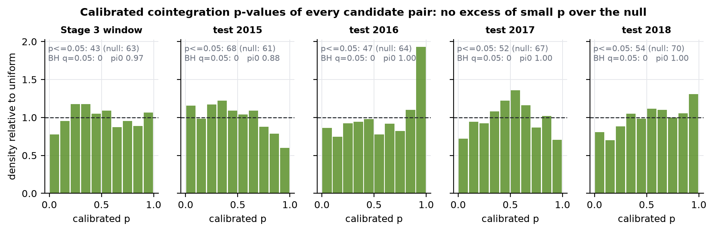
*Fig. 1. The histogram of calibrated p-values is flat: no excess of small p-values over the null in any of five screens.*

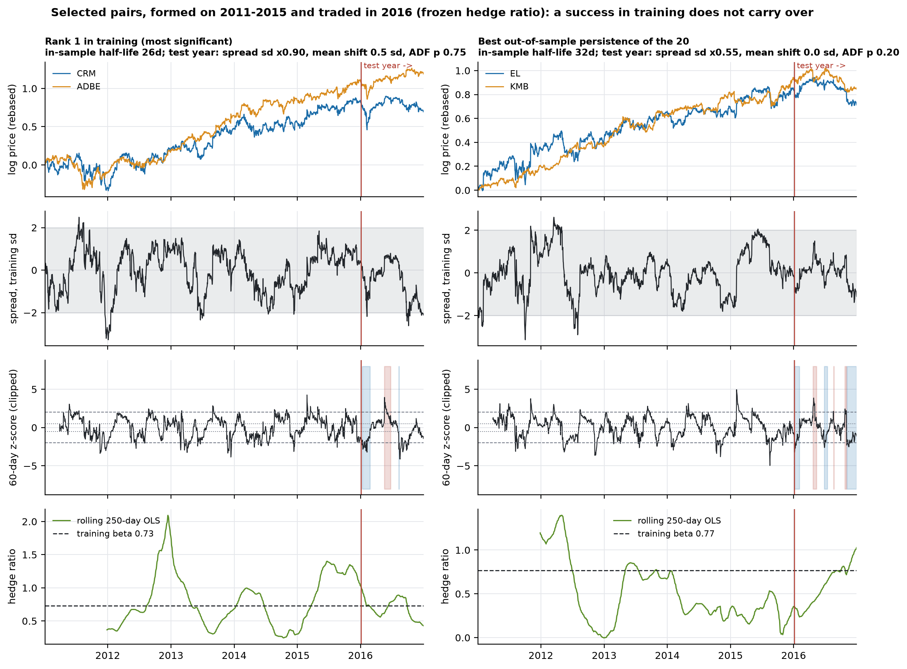
*Fig. 2. The rank-1 pair of the screen (left, chosen by rule, not by looks) and the pair with the best out-of-sample persistence (right). Top to bottom: prices, spread, 60-day z-score with positions, hedge ratio (frozen training value against a rolling estimate).*

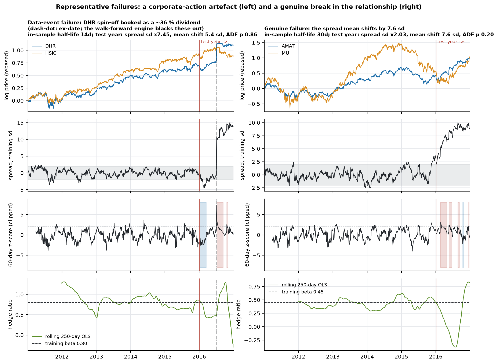
*Fig. 3. Representative failures: a corporate-action artefact (left) and a genuine break (right).*

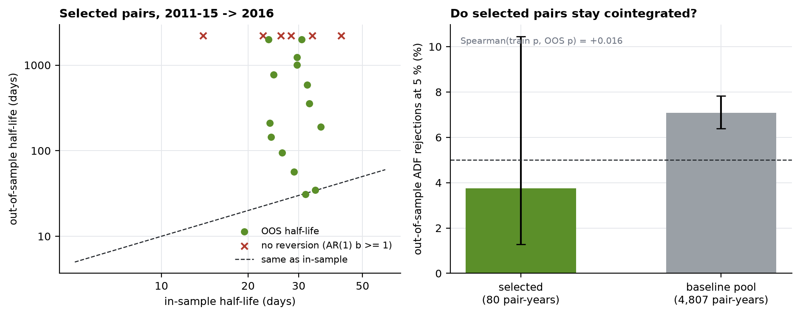
*Fig. 4. Left: in-sample against out-of-sample half-life for the 20 selected pairs (crosses: no reversion at all). Right: out-of-sample ADF rejections, selected against random pairs.*

### Experiment B — Stability

* **Hypothesis.** Cointegration relationships and hedge ratios are stable through time.
* **Data and method.** For every selected pair (80 pair-years) and the baseline pool (4807), freeze the training hedge ratio and mean and examine the spread over the test year (ADF, spread width, mean shift, AR(1), half-life); rank correlation between in- and out-of-sample strength; a sup-F test for a mean break in each strategy's returns; principal-subspace overlap of the rolling PCA factor space.
* **Results.** Selected pairs are **not** more likely to remain cointegrated than random ones (3.8% against 7.1% out-of-sample rejections), their spread is wider afterwards (median ratio 1.25 against 0.78), and the rank correlation between in-sample p-value and out-of-sample p-value is +0.016 (p = 0.26): in-sample cointegration strength carries no information about the future. The PCA factor space is far more stable — the market eigenvector has |cos| 0.993 at a year — but drifts: the 5-factor space overlaps 0.98 with itself a month later, 0.76 a year later and 0.59 after five years. 0 of 15 strategy series show a significant mean break (smallest p 0.22).
* **Uncertainty and limitations.** The break test has little power: with about 4 years it cannot see a fall from a Sharpe of 1 to 0, so a non-rejection is *not* evidence of stability.
* **Verdict: not supported for pairs; supported, with slow drift, for the PCA factor space.**

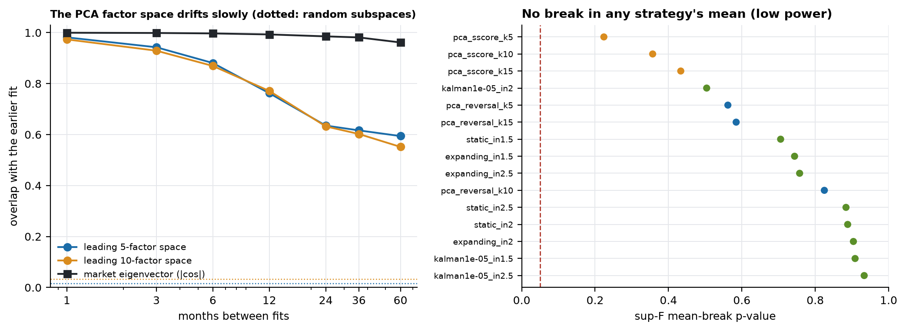
*Fig. 17. Left: overlap of the leading factor space with an earlier fit (dotted: random subspaces). Right: sup-F break-test p-values.*

### Experiment C — Signal robustness

* **Hypothesis.** Performance is robust to entry and exit thresholds and look-back windows.
* **Method.** One-at-a-time surfaces around two a-priori anchors for the PCA family (the best configuration, and the class defaults) and the pair defaults, plus an entry × factors grid; the screen's own thresholds (α, half-life band, portfolio size) re-selected from the saved screen tables. A rule fixed in advance defines "robust": at least 70 % of neighbours with positive gross Sharpe and a median at least half the anchor's. Every point is a *look* at research data, so the surface is registered as a diagnostic, nothing is selected from it, and none can advance.
* **Results.** PCA reversal (k = 5, anchor Sharpe +1.13): 100% of 23 neighbours positive, median +1.04, range +0.28 to +1.21 — **robust** by the rule; the s-score anchor likewise (100% positive, median +0.60). The gross Sharpe falls steadily with the number of factors (+1.01 at k = 3, +0.28 at k = 20). Turnover-lowering settings improve the net result but never make it positive: the best net Sharpe on the two PCA surfaces is -2.24 and -2.57. Pairs: 18% of 33 variants are positive gross (best +0.47, median -0.16), the best net is -0.41. Treating the whole surface (93 configurations) as trials would cut the best point's deflated Sharpe to 0.38.
* **Limitations.** One-at-a-time (interactions only in the entry × factors grid); one universe; four years.
* **Verdict: supported for the PCA gross effect, not supported for pairs, and irrelevant to profitability (net is negative everywhere).**

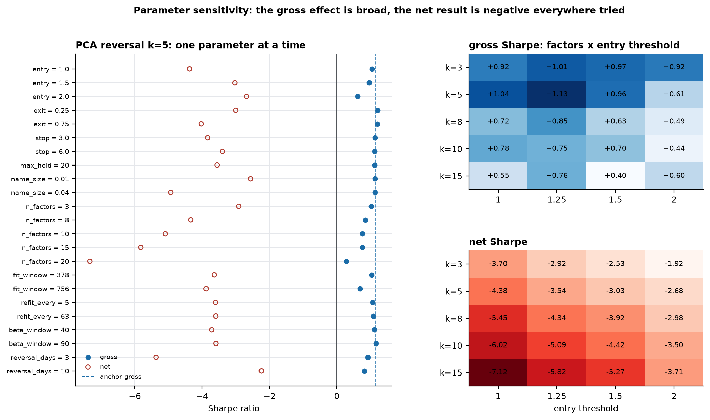
*Fig. 10. PCA reversal k = 5, one parameter at a time (left) and entry × factors (right): gross filled, net hollow.*

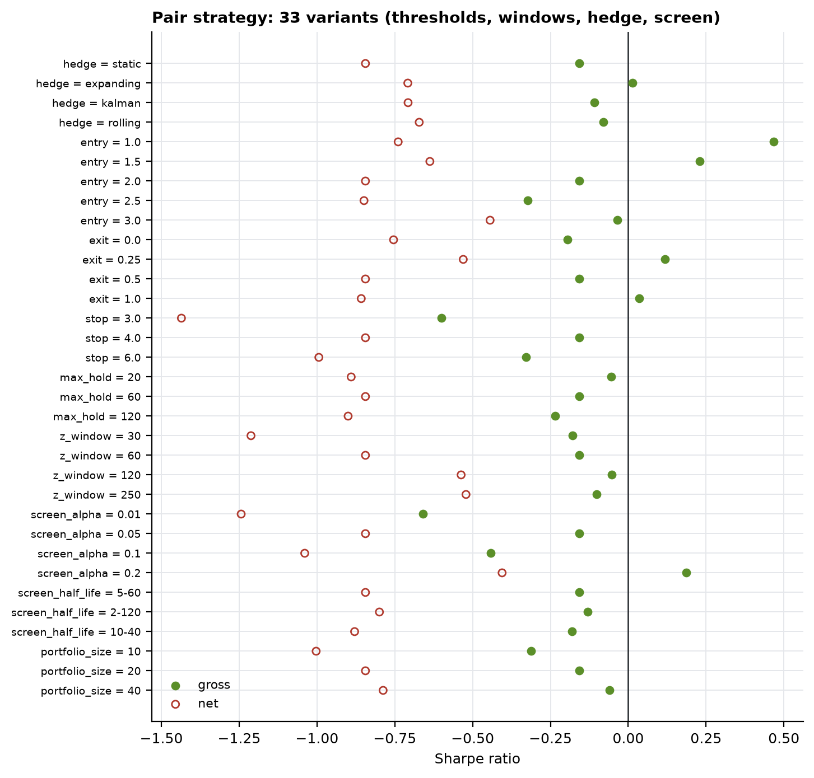
*Fig. 11. The pair strategy, 33 variants: no stable positive region.*

### Experiment D — PCA statistical arbitrage

* **Hypothesis.** Residuals from a common-factor model mean-revert exploitably.
* **Data and method.** The same universe, folds and cost model as the pairs (308–361 names per fold). PCA of standardised returns refitted every 21 sessions on the trailing 504, **only rows before the day scored**; 60-day betas; the residual of the scored day is out of sample; s-score and 5-day reversal signals; Avellaneda–Lee thresholds, unchanged; sizing by inverse residual volatility; a minimum-norm projection to exact dollar and factor neutrality. Grid: 2 signals × {5, 10, 15} factors (6 registered trials); control: raw returns, dollar-neutral only; 200-draw label-permutation placebo, calibrated on synthetic nulls; the finalist rule of Stage 6, unchanged.
* **Results.** Gross Sharpe +0.26 to +1.13; the best configuration (pca_reversal_k5, +1.13, interval +0.07 to +2.17) beats 99.5% of its placebo's draws; 1 of the 3 reversal configurations clears the pre-specified 95th percentile. The raw-return control earns -0.22 (it beats only 46% of its placebo's draws): the effect is in the residual, not in reversal itself. Turnover is 195–361× capital a year.
* **Uncertainty.** The real book is 1.7× as volatile as its placebo, so *net*-Sharpe percentiles against the placebo are not interpretable and only the gross percentile is used.
* **Failure cases and limitations.** A no-factor control that was not actually neutral (found by reading its 6.5× net exposure, fixed, re-run, first run voided in the registry); survivorship favours reversal (a delisted loser cannot be bought); execution at the same close that generates the signal is optimistic.
* **Verdict: supported gross, not exploitable.**

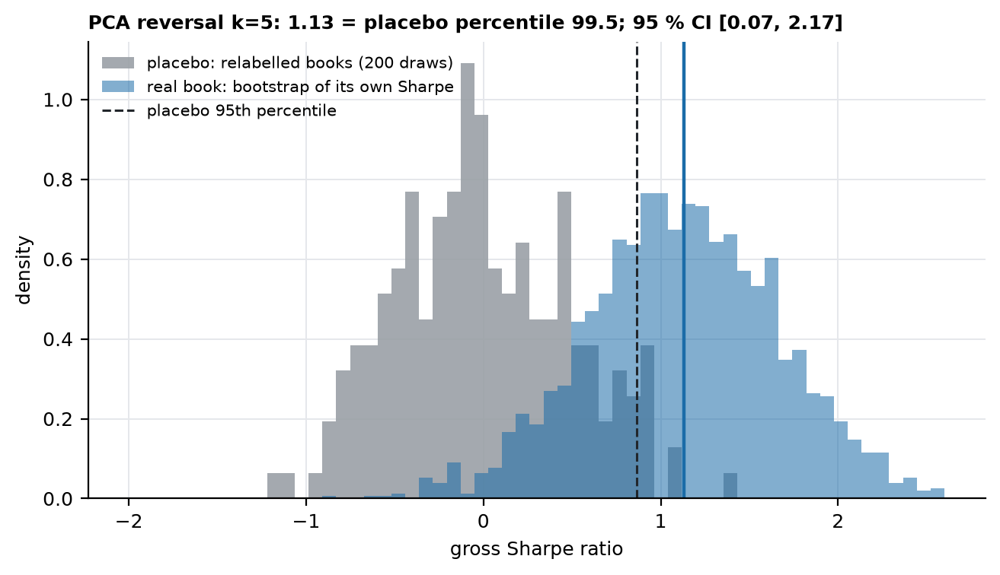
*Fig. 15. The best PCA configuration's bootstrap Sharpe distribution against the placebo distribution.*

### Experiment E — Transaction costs

* **Hypothesis.** Apparent performance disappears after realistic costs.
* **Method.** Per leg: tiered half-spread (1–5 bps by trailing dollar volume), 0.75 bp commission and fees, `0.5 σ √(Q/ADV)` impact, 50 bps a year borrow; $100M over 20 slots (pairs) or as fractions of capital (PCA); sensitivity to every component and to capital.
* **Results.** Net Sharpe is -1.01 to -0.58 for the nine pair configurations (turnover 11–28× a year) and -6.18 to -3.18 for the six PCA configurations. About 76% of the pairs' cost is market impact. Costs would have to fall to 0.04–0.24 of the central model for the PCA books, and 0.35 for the most cost-tolerant pair configuration, to reach break-even. The pre-specified finalist rule (net Sharpe > 0 *and* at least the median of the net placebo) qualifies **0** configurations, so nothing advanced to validation.
* **Limitations.** A model, not measured execution: no quotes, an impact coefficient from the literature, market-on-close fills; real costs could be lower (better execution) or higher (crowding).
* **Verdict: supported — costs are decisive.**

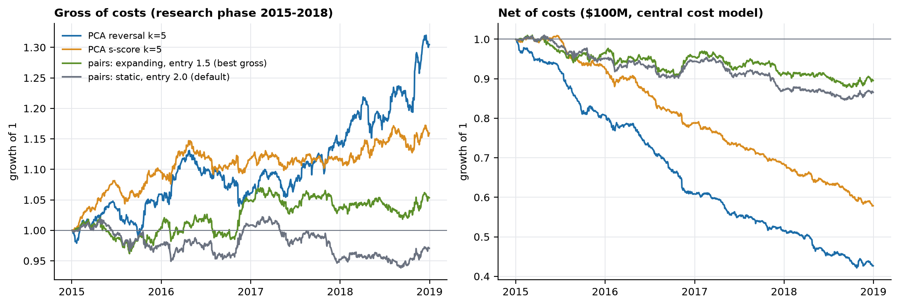
*Fig. 5. Cumulative growth, gross (left) and net (right): the best gross configuration of each family and the pair default.*

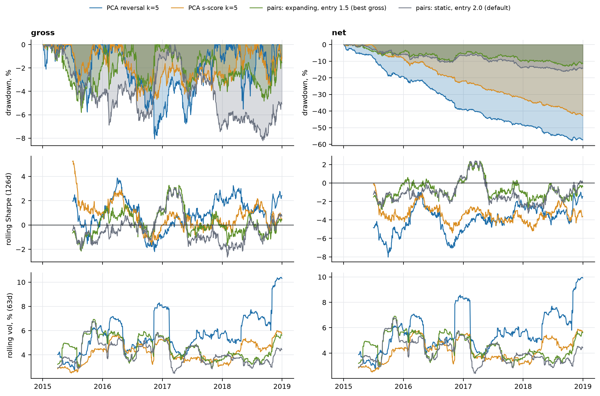
*Fig. 6. Drawdowns, rolling 126-day Sharpe and rolling 63-day volatility.*

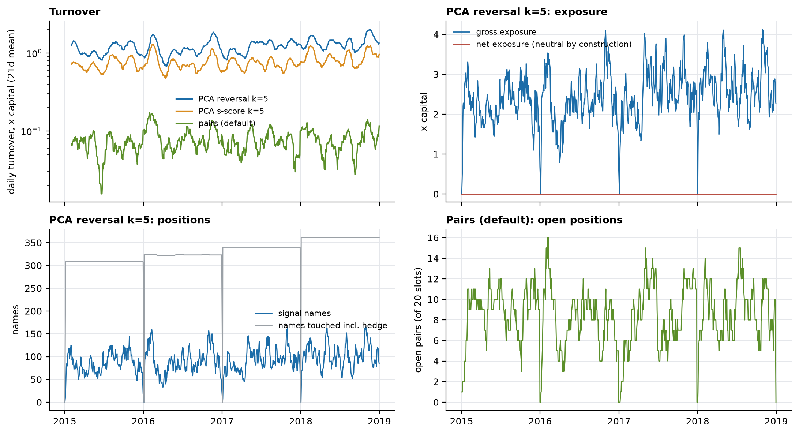
*Fig. 7. Turnover, PCA exposures and position counts, and the pair strategy's open positions (dips to zero are the forced flat at each year-end).*

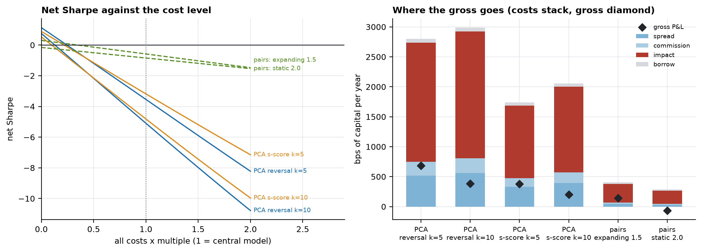
*Fig. 8. Net Sharpe against the cost level, and where the gross goes.*

### Experiment F — Multiple testing

* **Hypothesis.** Performance degrades materially once the number of hypotheses tested is accounted for.
* **Method.** The registry holds **24** distinct real-data strategy trials (30 runs). Probabilistic and deflated Sharpe (non-normality and selection), the expected maximum of N luck-only strategies, minimum backtest length; White's Reality Check, Hansen's SPA and Romano–Wolf on the 15 strategies that share the sample; Benjamini–Hochberg and -Yekutieli on the pair screens; CSCV probability of backtest overfitting. Each procedure was validated by Monte Carlo (size and power) before use; the decision rule was fixed in advance.
* **Results.** The best gross strategy has a PSR of 0.988 — significant on its own — but a deflated Sharpe of **0.65** at N = 24, benchmark 0.94 against its 1.13. Across effective trial counts of 3.0 to 9.3 it ranges 0.93 to 0.79: never 0.95. SPA gives p = 0.115 for all 15 strategies and 0.067 within the PCA family; the Reality Check gives 0.027 and 0.025, but it is not studentised and the best strategy is also the most volatile (equalising volatilities gives 0.046). Romano–Wolf: smallest adjusted p 0.115. PBO within the PCA family is 0.49 (a coin flip). **Pre-specified rule (DSR ≥ 0.95 and SPA ≤ 0.05): survives = no.** A Sharpe of 1 would take 3.9 years of data before the best of 24 luck-only strategies stops matching it; there are 4.0.
* **Uncertainty.** The trial count is a **lower bound** (design choices made while building were never registered) and the effective count is uncertain; the results move from 0.65 to 0.93 across the range. The tests are on mean returns over four years, so a modest real effect would be missed.
* **Verdict: supported — the best gross result is not distinguishable from selection luck.**

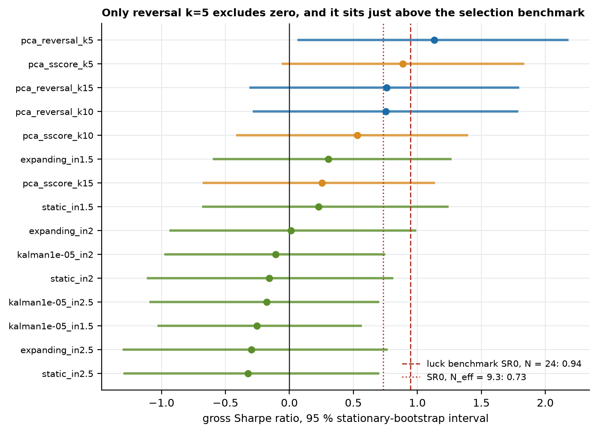
*Fig. 13. Gross Sharpe with bootstrap intervals for all 15 strategies against the selection benchmark.*

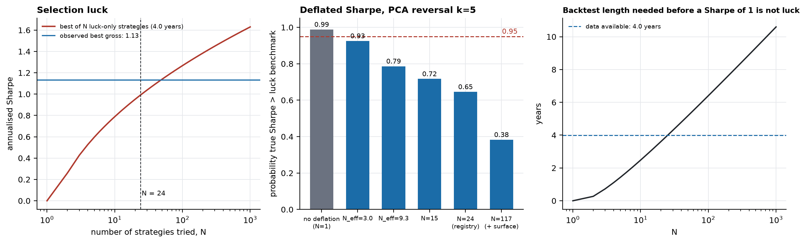
*Fig. 14. Selection luck as a function of N; the deflated Sharpe under different trial counts; the backtest length needed.*

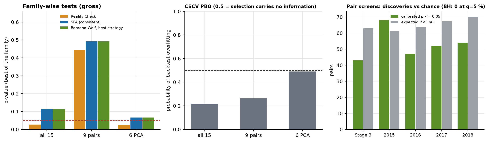
*Fig. 16. Family-wise tests, probability of backtest overfitting, and discoveries on the pair screens against chance.*

### Experiment G — Regimes

* **Hypothesis.** Statistical arbitrage behaves differently under different market regimes.
* **Method.** Three regimes fixed in advance — market volatility, market trend, cross-sectional dispersion — labelled from data through the previous day against an expanding median; 15 strategies × 3 regimes = 45 bootstrap tests of equal Sharpe, BH-corrected.
* **Results.** 5 of 45 tests have p < 0.05 (2.25 expected by chance) and **3 survive BH at 10 %**: the three PCA reversal configurations against the dispersion regime — one effect seen three times. The best configuration's gross Sharpe is +2.32 in high-dispersion periods and -0.92 otherwise (p = 0.001). *This contradicted my prior* (that nothing would survive), so it was probed with a labelled post-hoc follow-up: 19 high-dispersion episodes, a p-value stable across bootstrap block lengths of 5–63 days, a circular-shift test that preserves the label's persistence (p = 0.0034), and the same sign in 4 of 4 years. It does not rescue the strategy: in the favourable regime the net Sharpe is still -2.33, and trading only then would be a new unregistered configuration chosen after a look.
* **Limitations.** Four years, one split found after the fact, survivor-tilted market proxy used only to classify days.
* **Verdict: supported — one consistent regime dependence, economically plausible (idiosyncratic movement is what reversal is paid for), not a route to profitability.**

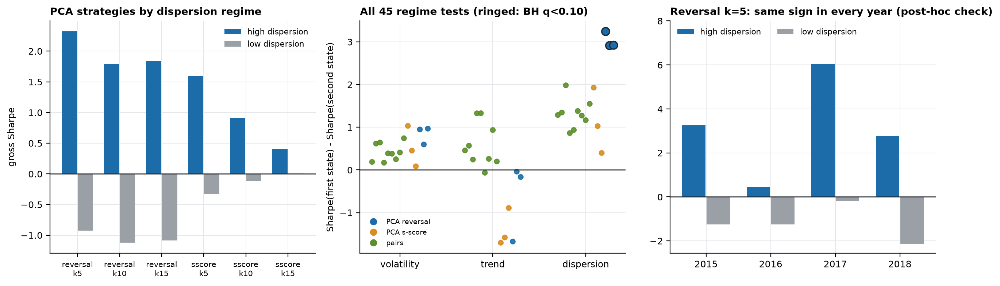
*Fig. 12. Left: PCA strategies by dispersion regime. Middle: all 45 regime tests (ringed: BH q < 0.10). Right: the contrast year by year.*

### Experiment H — Capacity

* **Hypothesis.** The strategy can deploy a meaningful amount of capital before estimated impact materially reduces performance.
* **Method.** In the cost model impact per unit of capital scales with √capital and participation with capital, so the saved components at $100M give the net return at any capital *exactly* (verified against real re-runs at $10M and $1B to 1e-12, and against a re-run of the engine at other capitals in the tests). Break-even capital and participation curves, with fixed-cost multipliers.
* **Results.** No PCA configuration breaks even at any capital (0 of 6): spread, commission and borrow alone (529–939 bps a year) exceed the gross (96–684). The best would need fixed costs 85% of the assumed level to break even at vanishing size and could then hold about $2.0M with fixed costs halved. Pair configurations that do break even: 2, at $247K and $2.3M, on a gross edge that is not distinguishable from zero. Five per cent of days already breach 10 % of a name's ADV between $35.5M and $43.0M.
* **Limitations.** **A model-based estimate, not observed live capacity**: the impact form and coefficient are assumptions; the analytic scaling holds only *within* that model.
* **Verdict: not supported — the constraint is turnover, not size.**

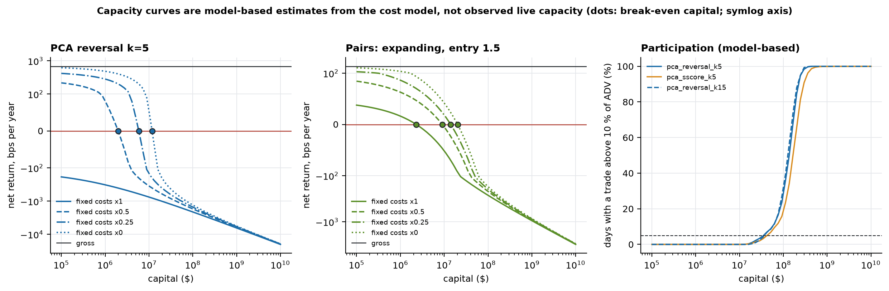
*Fig. 9. Net return against capital for the best PCA and pair configurations under different fixed-cost assumptions (dots: break-even capital), and participation.*

## 6. Negative results and failed hypotheses

Recorded rather than discarded (every run is in `docs/research_log.md`):

* **The cointegration screen has no discovery power beyond chance** in any of five screens (calibrated discoveries at or below the null count; Benjamini–Hochberg finds none at q = 5 %). The uncalibrated Engle–Granger test over-rejects on real prices by a factor of 1.4–3 (TR §4.3), so an uncalibrated screen would have "found" ~144 pairs.
* **Selection on in-sample cointegration is uninformative** (rank correlation +0.016), and selected pairs did *worse* than random ones out of sample.
* **The pair strategy has no gross edge** and its best configuration (entry 1.5, expanding hedge) has a Reality Check p of 0.44 for the family.
* **Costs eliminate every configuration at $100M.** The PCA books stay net-negative at $10M and with impact set to zero; only two pair configurations, whose gross edge is not distinguishable from zero, are positive, and only below about $2.3M.
* **Where my priors were wrong** (each stated before the result was known; the hypothesis codes are defined in TR §10.5 and §11.6): the Reality Check *did* reject for the PCA family (H8b) — and my first explanation, that pair books are quieter, was false and was replaced after testing; a regime effect *did* survive (H9e); two pair configurations *do* have a positive, if tiny, break-even capital (H9h).
* **Bugs found late, in order:** a look-ahead in the identity check (results identical after the fix); a no-factor control that was not neutral (fixed, re-run, first run voided); a latent bug in the pair state machine (a block on re-entry forgotten after a forced exit in the other direction; replayed on 53,671 real runs, zero differences). Mutation testing found real test gaps in every stage.

## 7. Failure cases

Fig. 3 (a data-event failure and a genuine break), Figs. 5–6 (the PCA books lose roughly 40–60 % net over four years while their gross curves look respectable, with drawdowns of about 8 %), Fig. 8 (impact dominates costs) and the pair strategy's own gross drawdowns in Fig. 6. The Kalman hedge, which helped in the Stage 4 simulator with a drifting hedge ratio, did not help on real pairs (TR §6.4, §7.4; Fig. 11). Nothing is excluded from the curves shown.

## 8. Limitations

* **Sample.** 1006 trading days, one market, one universe, one regime sequence; Sharpe intervals of roughly ±1. A modest real effect would not be detected, and the failure to reject anything is not evidence of absence.
* **Data.** Free data with survivorship bias in the optimistic direction; membership only from 2011; today's sector labels; vendor restatements invisible to the overlap check; an unofficial source.
* **Costs and execution.** A model, not measured: no quotes, market-on-close fills at the signal's own close (optimistic for short-horizon reversal), no financing of leveraged long books, hard-to-borrow names or taxes.
* **Multiple testing.** The registry count is a lower bound; effective counts are uncertain; joint tests cover the 15 trials that share a sample.
* **Statistics.** Mean-return tests over four years; stationarity assumed in the bootstrap; the Reality Check depends on the strategies' scale; the break test has little power; the placebo preserves score paths but not the link between a score and a stock's volatility estimate.
* **Design.** PCA refits monthly while pairs are frozen for a year; PCA hedges trade the whole universe daily; PCA uses fixed literature constants and was not tuned.
* **Everything here is research-phase evidence.** No strategy, screen or parameter has been evaluated on validation or holdout data. The one exception is the Stage 2 size diagnostic of the Engle–Granger test (windows 2011–15, 2016–20, 2021–25; independent shifted pairs; nothing selected; it predates the guard, which now forces that script to run unguarded and says so). It is the only registry record that lists those phases.

## 9. What would change the conclusion

Nothing in this report justifies opening the holdout. The one open scientific question is whether the **gross** PCA residual-reversal effect (and its dispersion dependence) is real. A clean way to ask it, *not run*, is a single pre-registered test on the unused validation years (2019–2021) — one configuration (the frozen best PCA reversal), no tuning, N = 1: does the gross Sharpe exceed zero with a PSR of at least 0.95 and the 95th percentile of the matched placebo? A positive answer would still leave a net-negative strategy; a negative one would close the question. Any *net* profitable design (lower turnover, passive execution, other horizons) is a new hypothesis and must be registered before it touches data. Because the validation window can be used only once, when to spend it is a decision for the project owner, not something the code will do on its own.

## 10. Reproducibility

```bash
uv venv --python 3.13 .venv && uv pip install --python .venv/bin/python -e ".[dev]"
.venv/bin/python -m statarb.data universe --fetch && .venv/bin/python -m statarb.data refresh   # data (vendor data cannot be frozen: quote the fingerprint)
.venv/bin/python -m pytest                       # the test suite (below)
for s in stage3_pair_discovery stage5_walkforward stage6_costs stage7_pca stage7_placebo_checks \
         stage8_multiple_testing stage8_rc_scale_check stage9_sensitivity stage9_regimes_breaks \
         stage9_regime_followup stage9_capacity; do PYTHONPATH=. .venv/bin/python -m experiments.$s; done
PYTHONPATH=. .venv/bin/python -m experiments.stage10_figures    # docs/figures/*.png
PYTHONPATH=. .venv/bin/python -m experiments.stage10_report     # README.md and docs/research_log.md from the results
```

* **What is reproduced.** Vendor data cannot be frozen, so reproduction means *archive the store and quote its fingerprint* (`07d3aa14cdacd9c9`). Given the same store, every experiment is deterministic from its recorded seed (Stage 3: 20260920; 5: 20260922; 7: 20260923; 8: 20260924; 9: 20260925–7); Stage 6 re-derived Stage 5's gross series to 2e-16 and Stage 7's grid reproduced identically on its re-run. The longest experiment (Stage 9's sensitivity, which re-runs four pair screens) takes roughly fifteen minutes on a laptop.
* **Every number in this report is generated.** `README.md` is rendered from `docs/README.template.md` by `experiments/stage10_report.py` from the saved result files; a test fails if the committed README differs from a fresh rendering. The figures are generated from the same files (`experiments/stage10_figures.py`), including a re-derivation of the Stage 7 placebo that is asserted to match its saved median.
* **The research log** (`docs/research_log.md`) is the append-only registry rendered as a table: every trial, kind, windows, seed and commit — voided and superseded runs included.
* **Where the detail is.** `docs/technical_record.md` is the stage-by-stage log of every design decision, validation and correction (cited above as "TR §").

## 11. Engineering, and coverage of the specified tests

570 tests (`pytest`, plus property-based tests with `hypothesis`); code style enforced with `ruff`; both run in CI (`.github/workflows/ci.yml`) from a clean install on Python 3.11 and 3.13, needing no network or price data. The specified categories (spec §26) map onto the suite as follows.

| Required (spec §26) | Where |
|---|---|
| Corporate-action handling | `test_corporate_actions.py`, `test_refresh.py` (splits, dividends, restatements) |
| Missing data, alignment | `test_alignment.py`, `test_validation.py` (no forward fill; listing/delisting; sessions) |
| Universe construction | `test_universe.py`, `test_identity.py` (point-in-time membership, symbol reuse) |
| Timestamp ordering | `test_calendar.py`, `test_validation.py`, `test_store.py` |
| ADF, cointegration, OU, half-life | `test_adf.py`, `test_cointegration.py`, `test_johansen.py`, `test_ou.py` (against `statsmodels` and analytic cases; size and power by Monte Carlo) |
| PCA decomposition | `test_pca.py` (against scikit-learn, identities, planted factors) |
| Other statistical utilities | `test_sharpe.py`, `test_multiple_testing.py`, `test_breaks.py`, `test_regimes.py` |
| No look-ahead | `test_leakage.py` (the detectors and their negative controls); applied in `test_zscore.py`, `test_residuals.py`, `test_walkforward.py`, `test_pca_walkforward.py`, `test_regimes.py` |
| Rolling windows | `test_rolling_hurst.py`, `test_zscore.py`, `test_metrics_registry.py` |
| Position sizing, portfolio constraints | `test_pair_pnl.py`, `test_neutral.py` (exact dollar/factor neutrality), `test_walkforward.py` (fixed slots) |
| Transaction costs, P&L accounting | `test_costs.py`, `test_capacity.py`, `test_pair_pnl.py`, `test_pca_walkforward.py` |
| Walk-forward boundaries | `test_walkforward.py`, `test_holdout.py` (phases, sealed holdout, ledger) |

Deviations from the suggested repository structure: the packages live under one importable `statarb/` (so a directory of stored *data* can never shadow a package named `data`); `portfolio/risk.py`, `constraints.py` and `backtest/engine.py`, `execution.py` are folded into `portfolio/neutral.py`, `backtest/walkforward.py` and `pca_walkforward.py` (neutrality and slots are the only portfolio constraints, and execution is at the decision close by assumption); the statistics live in `statistics/{bootstrap,sharpe,multiple_testing,breaks,regimes}.py` and the robustness tools in `backtest/capacity.py`. `notebooks/` is empty by choice: the figures are scripted.

```
statarb/    data/ selection/ models/ signals/ portfolio/ backtest/ statistics/ research/
experiments/  one script per experiment, results/*.json|csv, registry.jsonl, holdout_ledger.jsonl
docs/         README.template.md, technical_record.md, research_log.md, figures/
tests/        pytest + hypothesis        configs/  YAML configuration
```
